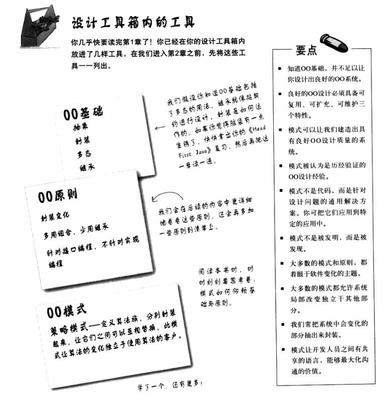

## 策略模式

> 将一些特定的行为分别封装成类（策略类），程序运行过程中可以 **动态** 地更换行为

意图：策略模式定义了算法族，分别封装起来，让他们之间可以相互替代。

优点：算法（行为）可以自由切换、避免使用多重条件判断、扩展性良好

缺点：策略类会增多、所有策略类需要对外暴露

##  观察者模式

> 观察者模式定义了对象之间的一对多依赖，这样一来，当一个对象改变状态时，它的所有依赖者都会收到通知并自动更新。

p93

## 设计原则

### 找出应用中可能需要变化的地方，把他们独立出来，不要和那些不需要变化的代码混在一起

### 针对接口编程，而不是针对实现编程

这样的做法迥异于以往，以前的做法是：行为来自 Duck 超类的具体实现，或是继承某个接口并由子类自行实现而来。这两种做法都是依赖于“实现”，我们被实现绑得死死的，没办法更改行为（除非写更多代码）。在我们的新设计中，鸭子的子类将使用接口(FlyBehavior.与QuackBehavior)所表示的行为，所以实际的“实现”不会被绑死在鸭子的子类中。（换句话说，特定的具体行为编写在实现了FlyBehavior-与QuakcBehavior的类中)

### 多用组合，少用继承

使用组合建立系统具有很大的弹性，不仅可将算法族封装成类，更可以 ==在运行时动态地改变行为==

### 为了交互对象之间的松耦合设计而努力

松耦合的设计之所以能让我们建立有弹性的OO系统，能够应对变化，是因为对象之间的互相依赖降到了最低。

## 第一章

